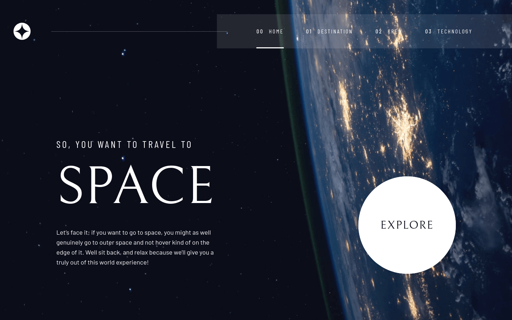

# Frontend Mentor - Space Tourism Website

This is a solution to the [Space tourism website challenge on Frontend Mentor](https://www.frontendmentor.io/challenges/space-tourism-multipage-website-gRWj1URZ3). Frontend Mentor challenges help you improve your coding skills by building realistic projects. 

## Table of contents

- [Overview](#overview)
  - [The challenge](#the-challenge)
  - [Screenshot](#screenshot)
  - [Links](#links)
- [My process](#my-process)
  - [Built with](#built-with)
  - [What I learned](#what-i-learned)
  - [Continued development](#continued-development)
  - [Useful resources](#useful-resources)
- [Author](#author)
- [Acknowledgments](#acknowledgments)

## Overview

### The challenge

Your challenge is to build out this multi-page space tourism website and get it looking as close to the design as possible.

Users should be able to:

- View the optimal layout for each of the website's pages depending on their device's screen size
- See hover states for all interactive elements on the page
- View each page and be able to toggle between the tabs to see new information

### Screenshot



### Links

Here are the links to my solution on GitHub and the live page where you can check out the profile card on your browser.

- Solution URL: [Github Repo](https://github.com/webshuriken/space-tourism-website)
- Live URL: [Four Card Feature](https://webshuriken.github.io/space-tourism-website/)

## My process :computer:

### Built with

- React, react-router
- CSS custom properties
- Tailwindcss
- Mobile-first workflow
- Figma design
- Git and Github/pages

### What I learned

Planning of the, React, components before coding improves the speed of the app creation. But this step must never be missed 
or taken for granted.

I also improved my react router understanding and learned how to implement the latest router version. It is much simpler.

```js
import { Routes, Route } from 'react-router-dom';

<Routes>
  <Route path='space-tourism-website/' element={ <Home /> } />
  <Route path='space-tourism-website/destination' element={ <Destination /> } />
  <Route path='space-tourism-website/crew' element={ <Crew /> } />
  <Route path='space-tourism-website/technology' element={ <Technology /> } />
</Routes>
```

Using TaildwindCSS is fantastic and allows granular levels of customisation! by using their configuration file.
It loads really quick, super intuitive and it can be used alongside CSS.

```js
theme: {
  extend: {
    colors: {
      'midnight': '#0b0d17',
      'tulip': '#d0d6f9',
      'white': '#ffffff'
    },
    fontFamily: {
      'bellefair': ['Bellefair'],
      'barlow-condensed': ['Barlow Condensed'],
    }
  }
}
```

### Continued development

I would like to feel confortable using the history feature of react-router and also be able to implement it without having to read documentation.

Even though I feel really confortable with tailwindcss, sometime I have to look back at the docs for reassurance. It would be amazing being able to recall them from memory.

### Useful resources

Here are the well written resources used throughout this project.

- [React Router](https://reactrouter.com/en/main/start/overview)
- [React updated docs](https://react.dev/)
- [Tailwindcss](https://tailwindcss.com/docs/installation)

## Author

- Website - [Carlos E Alford M](https://carlosealford.com)
- Frontend Mentor - [WebShuriken](https://www.frontendmentor.io/profile/WebShuriken)
- Twitter - [@webshuriken](https://www.twitter.com/webshuriken)

## Acknowledgments

To the whole Dev Community, keep dreaming and innovating. Thank you all. :smile:

**This project is a collaboration between us (Frontendmentor), Scrimba, and Kevin Powell. If you'd like to see how Kevin would tackle the project, you can [follow along on Scrimba's free course](https://scrimba.com/learn/spacetravel).**
